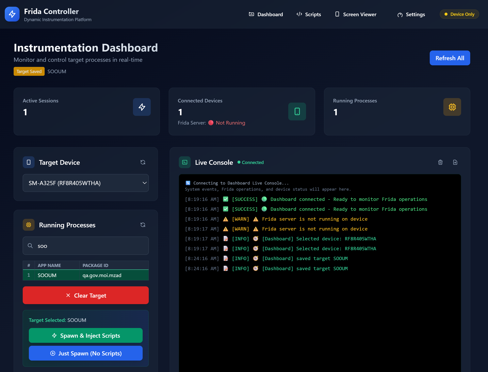
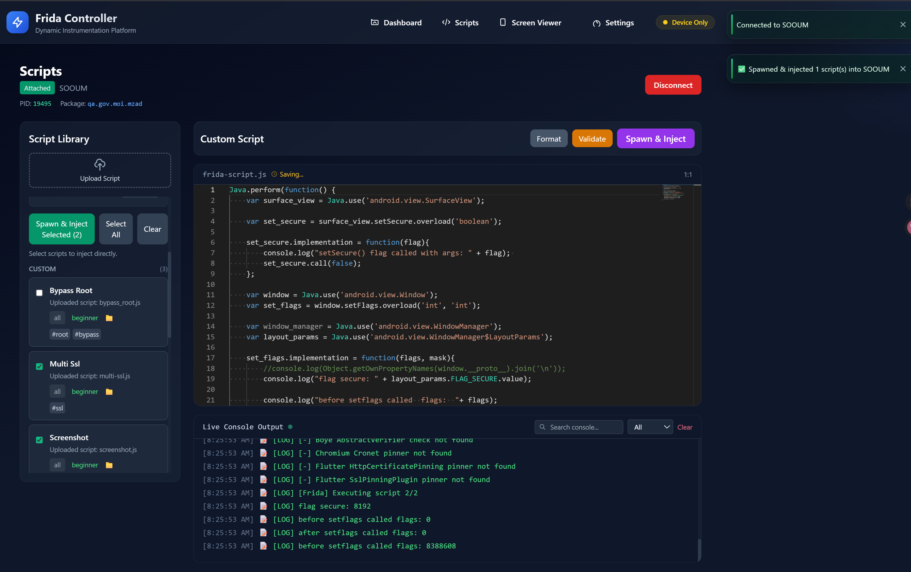
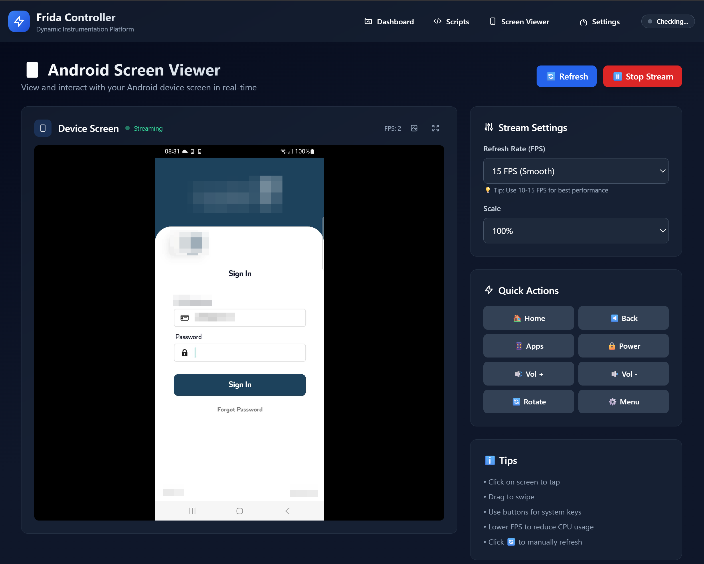

# Frida GUI

A web-based graphical interface for Frida dynamic instrumentation toolkit, designed for Android reverse engineering and security research.



## Screenshots




## Features

- **Dashboard**: Monitor Frida server status, manage ADB devices, and browse running processes
- **Script Library**: Built-in collection of common Frida scripts for SSL pinning bypass, root detection, and more
- **Script Editor**: Load and inject custom Frida scripts with real-time console output
- **Android Screen Viewer**: Real-time screen streaming with touch/swipe input and device control
- **Process Management**: Spawn, attach, and inject scripts into Android applications

## Requirements

- Python 3.7+
- ADB (Android Debug Bridge)
- Frida and frida-tools
- Rooted Android device with Frida server installed

## Usage

1. Start the Flask server:
```bash
python app.py
```

2. Open your browser and navigate to:
```
http://localhost:8010
```

3. Configure Frida server path in the dashboard settings

4. Start the Frida server from the GUI or manually via ADB

5. Select a target process and inject scripts

## Configuration

- **Frida Server Path**: Set the path where Frida server is installed on your device (default: `/data/local/tmp/frida-server`)
- **HTTP Proxy**: Configure device proxy settings for intercepting network traffic
- **Screen Streaming**: Adjust FPS and quality settings for optimal performance

## Screen Viewer Controls

- **Click**: Tap on screen
- **Drag**: Swipe gesture
- **Quick Actions**: Home, Back, Volume, Power buttons
- **Screenshot**: Capture high-quality PNG
- **Stream**: Real-time screen mirroring at configurable FPS

## Script Library

Pre-built scripts include:
- SSL Pinning Bypass (multiple methods)
- Root Detection Bypass
- Emulator Detection Bypass
- Debug Detection Bypass
- Memory Dumping Utilities

## Troubleshooting

### Frida server not detected

Ensure the server is running:
```bash
adb shell "ps -A | grep frida"
```

Check the binary name matches your configuration.

### ADB connection issues

```bash
adb kill-server
adb start-server
adb devices
```

## Security Considerations

- This tool is intended for security research and testing on devices you own
- Always obtain proper authorization before testing applications
- Use responsibly and ethically

## License

MIT License

## Contributing

Contributions are welcome. Please open an issue or submit a pull request.

## Acknowledgments

- [Frida](https://frida.re/) - Dynamic instrumentation toolkit
- Built with Flask, Socket.IO, and Tailwind CSS
